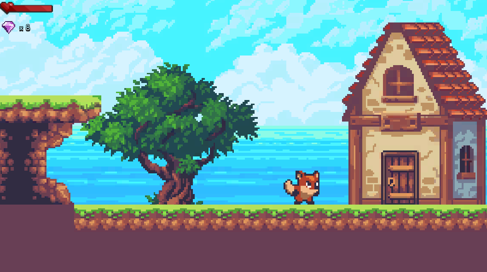

# 2D-Platform
## Juego de plataformas 2D con Unity
El credito por los sprites es para [Ansimuz](https://ansimuz.itch.io) y su trabajo [SunnyLand](https://ansimuz.itch.io/sunny-land-pixel-game-art).

Programado el movimiento de todos los personajes y objetos. El movimiento, salto y muerte del zorro como personaje controlable, de la rana y de la zariguella como enemigos. Y la cerezas y gemas como objetos consumibles.

